# 📋 SỔ TAY THỰC HÀNH CÁ NHÂN & CHECKLIST TIẾN ĐỘ

---

## 🎯 HÌNH THỨC THỰC HIỆN: CÁ NHÂN

Bài thực hành thiết kế dành cho cá nhân học viên làm chủ quy trình phát triển Tác tử AI (AI Agent):
- Mỗi học viên tự Fork Repo về GitHub cá nhân.
- Tự hoàn thiện mã nguồn, tự đẩy bài nộp lên LMS VLearn.

---

## ⏱️ LỘ TRÌNH THỰC HÀNH (180 PHÚT LÀM BÀI)

```mermaid
gantt
    title TIẾN TRÌNH THỰC HÀNH 180 PHÚT
    dateFormat  m
    axisFormat %M m
    
    Phần 1: Agentic Fit & Tool Schemas       :m1, 0, 45m
    Phần 2: ReAct Loop & MCP Server          :m2, after m1, 60m
    Phần 3: Test Execution & Trace Log       :m3, after m2, 45m
    Phần 4: Self-Audit & Push GitHub Nộp bài :m4, after m3, 30m
```

---

## 📝 CHECKLIST CÁ NHÂN THEO TỪNG MỐC THỜI GIAN

### 🔷 PHẦN 1 (45 phút): Đánh giá Agentic Fit & Tool Schemas
* [x] Chọn chủ đề: Trợ lý tìm kiếm và đặt lịch xem phòng trọ sinh viên (Student Housing Agent).
* [x] Điền bảng Scoring Matrix 4 tiêu chí Agentic Fit (18/20) vào file `docs/trace_eval.md`.
* [x] Khai báo đầy đủ 4 Tool Schemas đúng chuẩn JSON Schema trong `src/tools.py` (`search_rental_rooms`, `get_property_ratings`, `get_nearby_bus_routes`, `book_room_viewing`).
* [x] Chuẩn hóa bộ 5 Test Cases nghiệm thu đa cấp độ vào file `config/test_cases.json`.

---

### 🔷 PHẦN 2 (60 phút): ReAct Agent & MCP Server
* [x] Hoàn thiện MCP Housing Server (`src/mcp_server.py`) theo giao thức JSON-RPC 2.0 Facade.
* [x] Chạy lệnh `python src/mcp_server.py` xác nhận công bố 4 tools thành công.
* [x] Lắp ráp vòng lặp ReAct Native Tool Calling, cơ chế GPS Haversine động và hệ thống Guardrails trong `src/app.py`.

---

### 🔷 PHẦN 3 (45 phút): Chạy Kiểm thử & Xuất Trace Waterfall Log
* [x] Kiểm thử chế độ Mock Offline và cấu hình OpenAI Live trong `.env`.
* [x] Chạy lệnh `python src/app.py --all --mode mock` đạt kết quả **5/5 PASS**.
* [x] Xuất file vết `docs/trace_waterfall.json` đầy đủ độ trễ đo thực tế và che giấu PII.
* [x] Trích xuất đoạn Trace log tiêu biểu (TC04) vào báo cáo `docs/trace_eval.md`.

---

### 🔷 PHẦN 4 (30 phút): Tự kiểm tra & Nộp bài Git/GitHub
* [x] Kiểm tra tên Repo cá nhân đúng chuẩn: **`K4B-DAY03-PhamHoangTrong-2A202602765`**.
* [x] Bổ sung Web API FastAPI (`src/web_api.py`) và Frontend trực quan (`web/`).
* [x] Cập nhật toàn bộ tài liệu đặc tả và hướng dẫn vận hành trong `docs/`.
* [ ] Commit và Push toàn bộ mã nguồn lên GitHub cá nhân.
* [ ] Nộp link Repo GitHub cá nhân lên hệ thống LMS VLearn.

---

> [!NOTE]
> **HOÀN THÀNH QUY TRÌNH:** Học viên đã xem xong Sổ tay thực hành. Để quay lại Trang chủ xem lại tổng quan bài học:  
> 👉 **[Quay lại Bước 1: Trang chủ README.md](../README.md)**
